# Send messages to Synapse Real-Time Analytics in Fabric for Apache Kafka Ecosystems - Java

**This quickstart is based on the official [Azure Event Hubs for Kafka](https://github.com/Azure/azure-event-hubs-for-kafka) example, adapted to work with [Microsoft Fabric](https://aka.ms/fabric-trial).**

This example will show you how to send data from Kafka to [Synapse Real-time Analytics in Fabric](https://learn.microsoft.com/fabric/real-time-analytics/overview?WT.mc_id=data-106285-alvidela).

You will use a Fabric Eventstream to receive data from Kafka, and then send it to a KQL-database for further processing. Eventstream support Custom Apps that are backed by an Event Hub. This makes Fabric Eventstream compatible with Kafka, so you can use any Kafka client to send data to Fabric.

If you want to learn more about how Fabric supports Kafka, check out [What is Azure Event Hubs for Apache Kafka](https://learn.microsoft.com/azure/event-hubs/azure-event-hubs-kafka-overview?WT.mc_id=data-106285-alvidela).

## Prerequisites

Before you begin, you will need access to an active Azure subscription. More details on how to activate a free trial account, visit: [Microsoft Fabric (Preview) trial](https://aka.ms/fabric-trial)

In addition:

* [Java Development Kit (JDK) 1.7+](http://www.oracle.com/technetwork/java/javase/downloads/index.html)
    * On Ubuntu, run `apt-get install default-jdk` to install the JDK.
    * Be sure to set the JAVA_HOME environment variable to point to the folder where the JDK is installed.
* [Download](http://maven.apache.org/download.cgi) and [install](http://maven.apache.org/install.html) a Maven binary archive
    * On Ubuntu, you can run `apt-get install maven` to install Maven.
* [Git](https://www.git-scm.com/downloads)
    * On Ubuntu, you can run `sudo apt-get install git` to install Git.

## Create an Eventstream

To create an Eventstream, you need to have a [Fabric workspace](https://learn.microsoft.com/fabric/get-started/create-workspaces?WT.mc_id=data-106285-alvidela).

Once you have your workspace, you can create an Eventstream by selecting the "Create" button, and the scrolling down until you see the Eventstream option. Full documentation on how to create an Eventstream can be found [here](https://learn.microsoft.com/fabric/real-time-analytics/event-streams/create-manage-an-eventstream?WT.mc_id=data-106285-alvidela).

Name your Eventstream "kafka-to-kql-eventstream", and select "Create".


## Create a Custom App

After you have created your Eventstream, select "New source", and then select "Custom App".


Name your custom app "from-kafka". 

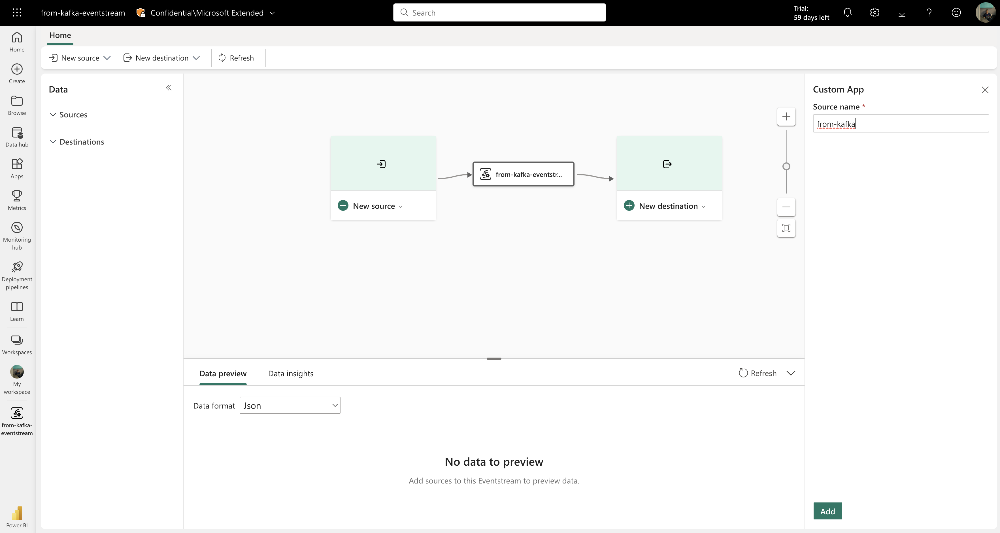

Once the custom app is created, select it. You will see the EventHub connection string for your Eventstream in the _Information_ panel at the bottom. Copy this _Connection string-primary key_, as you will need it later.

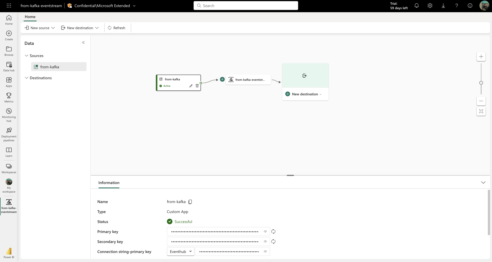

### FQDN

For these samples, you will need the connection string as well as the FQDN that points to your Fabric Custom App. **The FQDN can be found within your connection string as follows**:

`Endpoint=sb://`**`mynamespace.servicebus.windows.net`**`/;SharedAccessKeyName=XXXXXX;SharedAccessKey=XXXXXX;EntityPath=XXXXXX`

## Clone the example project

Now that you have your Custom App connection string, clone the [Fabric Kafka Sample]() repository to your local machine:

```bash
git clone https://github.com/videlalvaro/fabric-kafka-sample
cd fabric-kafka-sample/producer
```

## The Data Producer

Using the provided producer example, send messages to the Fabric Eventstream service. To change the Kafka version, change the dependency in the pom file to the desired version.

We are going to send telemetry data to the Eventstream. The data is in JSON format, and looks like this:

```json
{
    "timestamp": "<timestamp>",
    "temperature": 25.0,
    "humidity": 13.0
}
```

For our example, this data will be randomly generated by the producer.

### Provide an Event Hubs Kafka endpoint

#### producer.config

Update the `bootstrap.servers` and `sasl.jaas.config` values in `producer/src/main/resources/producer.config` to direct the producer to the Custom Apps endpoint with the correct authentication.

```config
bootstrap.servers=mynamespace.servicebus.windows.net:9093
security.protocol=SASL_SSL
sasl.mechanism=PLAIN
sasl.jaas.config=org.apache.kafka.common.security.plain.PlainLoginModule required username="$ConnectionString" password="Endpoint=sb://mynamespace.servicebus.windows.net/;SharedAccessKeyName=XXXXXX;SharedAccessKey=XXXXXX;EntityPath=XXXXXX";
```

### Run the producer from the CLI

This sample is configured to send messages to a Kafka topic that corresponds with your Custom App. In this case obtain the `EntityPath` value from the connection string, since we provide that as a command line argument to the Producer class.

```
Endpoint=sb://mynamespace.servicebus.windows.net/;SharedAccessKeyName=XXXXXX;SharedAccessKey=XXXXXX;EntityPath=XXXXXX
```

To run the producer from the command line, generate the JAR and then run from within Maven (alternatively, generate the JAR using Maven, then run in Java by adding the necessary Kafka JAR(s) to the classpath):

```bash
mvn clean package
mvn exec:java -Dexec.mainClass="TestProducer" \
-Dexec.args="<EntityPathValue>"
```

The producer will now begin sending events to the Fabric Custom App via the Kafka-enabled Event Hub. 

## From Eventstream to KQL-Database

Before start working with Eventstream, you need to create a KQL Database. This is the database that will hold the data that you send to the Eventstream.

### Create the KQL Database

In your Fabric workspace, select New, and then choose "KQL Database" from the dropdown menu. Name your database "es-to-kql-database", and select "Create".

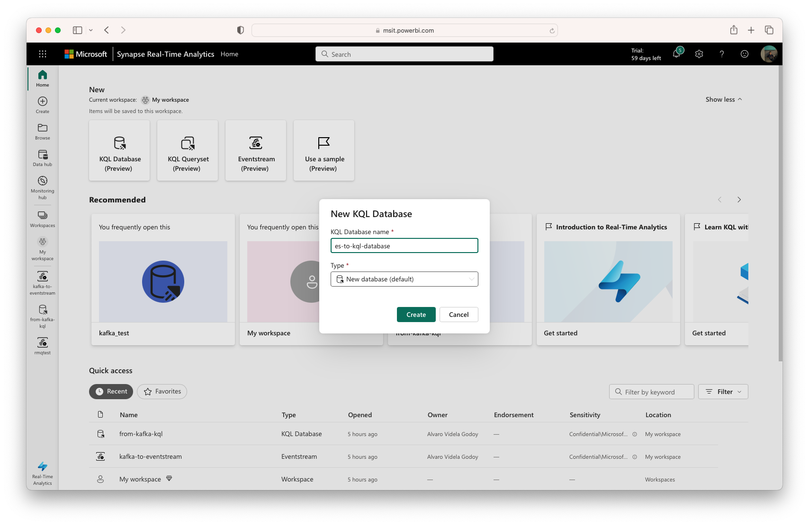

### Configure the Eventstream

Back in the Eventstream page, select the Eventstream in the center of the screen.

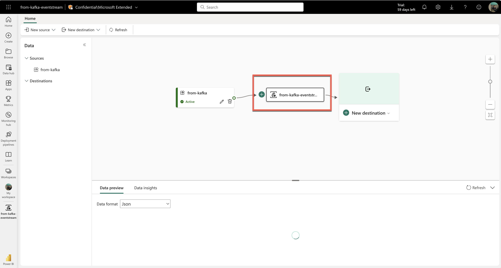

Once you select it, you will see the preview table below being populated with your data:

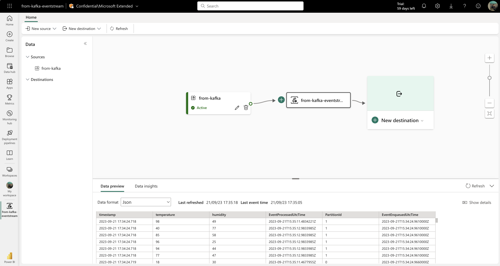

Now, select "New destination", and then select "KQL Database" from the dropdown menu. 

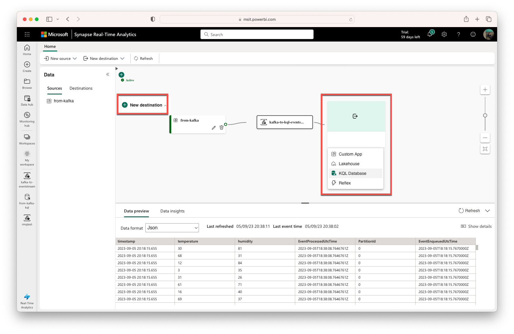

Name your destination "es-to-kql". Enter your Workspace name, and finally name your KQL Database as "es-to-kql-database". Then select "Create and configure".


### Ingest the data to a KQL Table

Now it's time to configure the KQL Table that will hold our realtime data. Name the table "from-kafka-kql-table" and select "Next: Source".


On the next screen, leave the default values and select "Next: Schema".

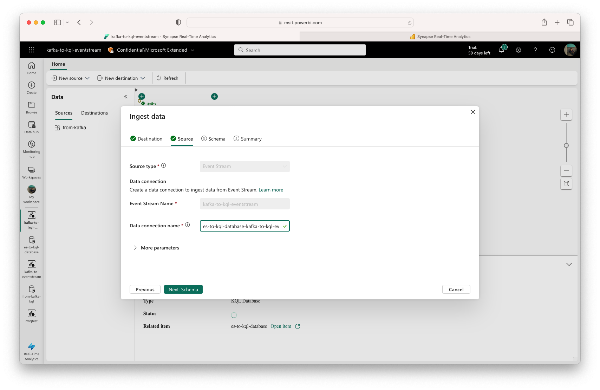

Then on schema wait until the data is loaded in the preview. Then select the "Data format" dropdown and choose JSON, since that's the format of our data. You will see that the preview table automatically parses the data offering the different fields as columns with the right data types.

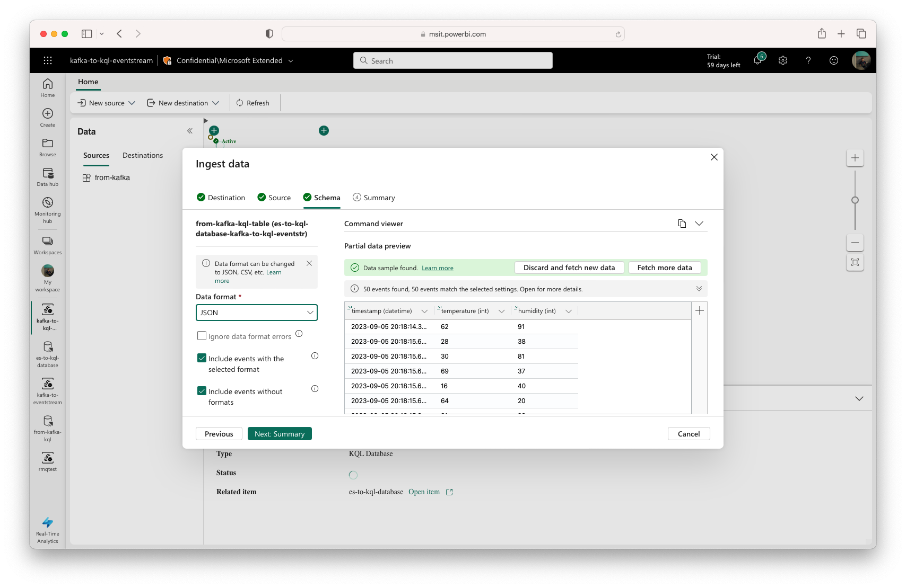

Select "Next: Summary".

Now you will see the “Continuous ingestion from Eventstream established” screen. Select "Close" to finis the process of setting up your Custom App, ingesting data from Kafka, and sending it to a KQL Database.


### Query the KQL Table

Close the previous confirmation screen. In the information pane at the bottom, you will see the "Status" marked as "Successful". Below you will have a link to your KQL Database. Select "Open item".

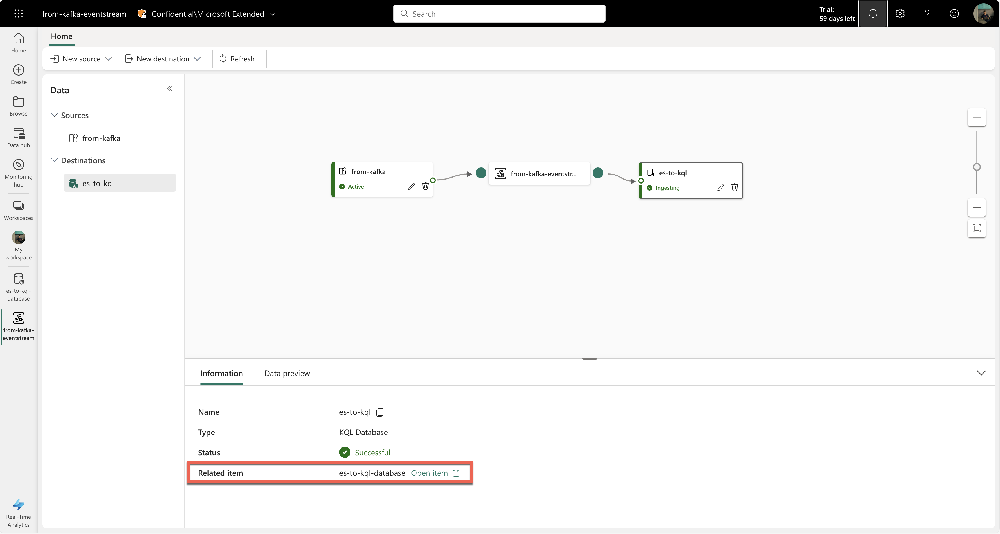

This will open a new tab with your KQL Database. Select your table in the Data tree pane, and then select "Explore your data".

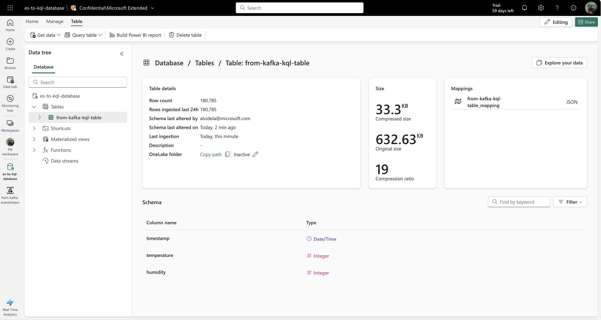

Type the following query in the query editor and select "Run":

```kql
['from-kafka-kql-table']
| take 100
```

If all went well you should see your query results like this:

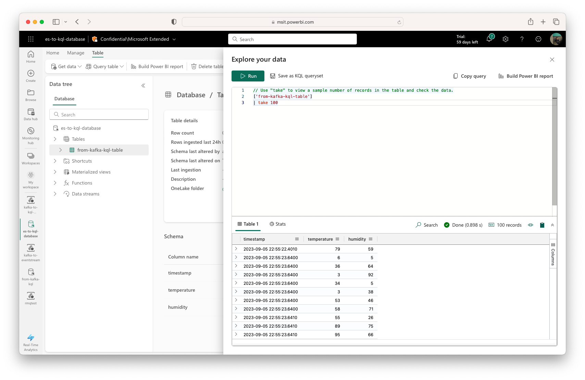

From here on you can use the KQL Database as your bulding block for further processing,like generating Power BI reports. For more information on how to use KQL, check out the [Kusto Query Language (KQL) overview](https://learn.microsoft.com/azure/data-explorer/kusto/query/?WT.mc_id=data-106285-alvidela) documentation.

# Conclusion

In this quickstart you have learned how to send data from Kafka to [Synapse Real-time Analytics in Fabric](https://learn.microsoft.com/fabric/real-time-analytics/overview?WT.mc_id=data-106285-alvidela). 

You learned how to create an Eventstream, that uses a Custom App as source for receiving data from Kafka.

You have also ran your first KQL Query, and now are ready to explore the world of real-time analytics. Time to create your first Power BI report!

# Keep learning

- [Synapse Real-time Analytics in Fabric](https://learn.microsoft.com/fabric/real-time-analytics/overview?WT.mc_id=data-106285-alvidela)
- [What is Azure Event Hubs for Apache Kafka](https://learn.microsoft.com/azure/event-hubs/azure-event-hubs-kafka-overview?WT.mc_id=data-106285-alvidela)
- [Kusto Query Language (KQL) overview](https://learn.microsoft.com/azure/data-explorer/kusto/query/?WT.mc_id=data-106285-alvidela)
