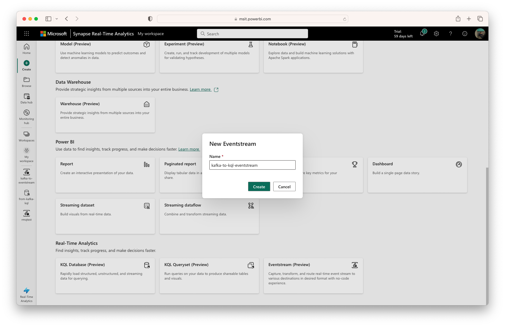

# Send messages to Synapse Real-Time Analytics in Fabric for Apache Kafka Ecosystems - Java

**This quickstart is based on the official [Azure Event Hubs for Kafka](https://github.com/Azure/azure-event-hubs-for-kafka) example, adapted to work with [Microsoft Fabric](https://www.microsoft.com/microsoft-fabric).**

This example will show you how to send data from Kafka to [Synapse Real-time Analytics in Fabric](https://learn.microsoft.com/fabric/real-time-analytics/overview).

You will use a Fabric Eventstream to receive data from Kafka, and then send it to a KQL-database for further processing. Eventstreams support Custom Apps that are backed by an Event Hub. This makes Fabric Eventstreams compatible with Kafka, so you can use any Kafka client to send data to Fabric.

If you want to learn more about how Fabric supports Kafka, check out [What is Azure Event Hubs for Apache Kafka](https://learn.microsoft.com/en-us/azure/event-hubs/azure-event-hubs-kafka-overview)).

## Prerequisites

Before you begin, you will need access to an active Azure subscription. More details on how to activate a free trial account, visit: [Microsoft Fabric (Preview) trial](https://aka.ms/fabric-trial)

In addition:

* [Java Development Kit (JDK) 1.7+](http://www.oracle.com/technetwork/java/javase/downloads/index.html)
    * On Ubuntu, run `apt-get install default-jdk` to install the JDK.
    * Be sure to set the JAVA_HOME environment variable to point to the folder where the JDK is installed.
* [Download](http://maven.apache.org/download.cgi) and [install](http://maven.apache.org/install.html) a Maven binary archive
    * On Ubuntu, you can run `apt-get install maven` to install Maven.
* [Git](https://www.git-scm.com/downloads)
    * On Ubuntu, you can run `sudo apt-get install git` to install Git.

## Create an Eventstream

To create an Eventstream, you need to have a Fabric workspace. If you don't have one, you can create one for free by following the instructions [here](https://learn.microsoft.com/en-us/fabric/get-started/create-workspaces).

Once you have your workspace, you can create an Eventstream by selecting the "Create" button, and the scrolling down until you see the Eventstream option. Full documentation on how to create an Eventstream can be found [here](https://learn.microsoft.com/en-us/fabric/real-time-analytics/event-streams/create-manage-an-eventstream).



## Create a Custom App

After you have created your Eventstream, select "New source", and then select "Custom App". Name your custom app "from-kafka". 

Once the custom app is created, you will see the connection string for your Eventstream in the _Information_ panel at the bottom. Copy this _Connection string-primary key_, as you will need it later.


### FQDN

For these samples, you will need the connection string as well as the FQDN that points to your Fabric Custom App. **The FQDN can be found within your connection string as follows**:

`Endpoint=sb://`**`mynamespace.servicebus.windows.net`**`/;SharedAccessKeyName=XXXXXX;SharedAccessKey=XXXXXX;EntityPath=XXXXXX`

## Clone the example project

Now that you have your Custom App connection string, clone the [Fabric Kafka Sample]() repository to your local machine:

```bash
git clone https://github.com/videlalvaro/fabric-kafka-sample
cd fabric-kafka-sample/producer
```

## The Data Producer

Using the provided producer example, send messages to the Fabric Eventstream service. To change the Kafka version, change the dependency in the pom file to the desired version.

### Provide an Event Hubs Kafka endpoint

#### producer.config

Update the `bootstrap.servers` and `sasl.jaas.config` values in `producer/src/main/resources/producer.config` to direct the producer to the Custom Apps endpoint with the correct authentication.

```config
bootstrap.servers=mynamespace.servicebus.windows.net:9093
security.protocol=SASL_SSL
sasl.mechanism=PLAIN
sasl.jaas.config=org.apache.kafka.common.security.plain.PlainLoginModule required username="$ConnectionString" password="Endpoint=sb://mynamespace.servicebus.windows.net/;SharedAccessKeyName=XXXXXX;SharedAccessKey=XXXXXX;EntityPath=XXXXXX";
```

### Run the producer from command line

This sample is configured to send messages to a Kafka topic that corresponds with your Custom App. In this case obtain the `EntityPath` value from the connection string, since we provide that as a command line argument to the Producer class.

```
Endpoint=sb://mynamespace.servicebus.windows.net/;SharedAccessKeyName=XXXXXX;SharedAccessKey=XXXXXX;EntityPath=XXXXXX
```

To run the producer from the command line, generate the JAR and then run from within Maven (alternatively, generate the JAR using Maven, then run in Java by adding the necessary Kafka JAR(s) to the classpath):

```bash
mvn clean package
mvn exec:java -Dexec.mainClass="TestProducer" -Dexec.args="<EntityIdValue>"
```

The producer will now begin sending events to the Fabric Custom App via the Kafka-enabled Event Hub. 
